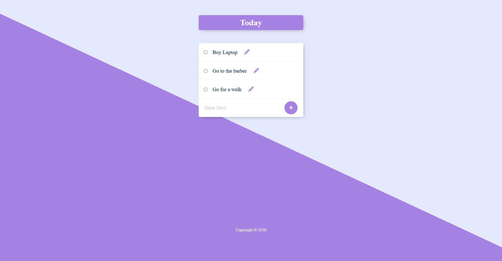

# To-Do App — Node.js, Express & PostgreSQL

A simple full-stack to-do list app built to practice backend development with **Node.js**, **Express**, and **PostgreSQL**. Supports creating, editing, and deleting tasks, with data persisted in a PostgreSQL database.



## Features

- ✅ View all tasks
- ➕ Add a new task
- ✏️ Edit an existing task
- 🗑️ Delete a task
- 🗄️ Data persisted in PostgreSQL (not lost on server restart)

## Tech Stack

- **Backend:** Node.js, Express
- **Database:** PostgreSQL (via `pg`)
- **Templating:** EJS
- **Environment Config:** dotenv

## Prerequisites

Before running this project, make sure you have installed:

- [Node.js](https://nodejs.org/) (v18 or higher recommended)
- [PostgreSQL](https://www.postgresql.org/download/) installed and running locally

## Getting Started

### 1. Clone the repository

```bash
git clone git@github.com:yourusername/todo-app-node-postgres.git
cd todo-app-node-postgres
```

### 2. Install dependencies

```bash
npm install
```

### 3. Set up the database

Create a PostgreSQL database and an `items` table:

```sql
CREATE DATABASE todo_app;

\c todo_app

CREATE TABLE items (
  id SERIAL PRIMARY KEY,
  title VARCHAR(255) NOT NULL
);
```

### 4. Configure environment variables

Copy the example env file and fill in your own database credentials:

```bash
cp .env.example .env
```

Then edit `.env`:

```env
DB_HOST=localhost
DB_PORT=5432
DB_USER=your_postgres_user
DB_PASSWORD=your_postgres_password
DB_NAME=todo_app
PORT=3000
```

> ⚠️ Never commit your `.env` file — it's already excluded via `.gitignore`.

### 5. Run the app

```bash
npm start
```

The app will be running at **http://localhost:3000**

## Project Structure

```
todo-app-node-postgres/
├── public/           # Static assets (CSS, etc.)
├── views/             # EJS templates
├── index.js           # Main server file
├── .env.example        # Example environment variables
├── .gitignore
├── package.json
└── README.md
```

## What I Practiced

This project was built to practice:
- Connecting an Express app to a PostgreSQL database
- Writing parameterized SQL queries to prevent SQL injection
- Basic CRUD operations (Create, Read, Update, Delete)
- Using environment variables to keep credentials out of source control
- Server-side rendering with EJS

## License

This project is open source and available under the [MIT License](LICENSE).
